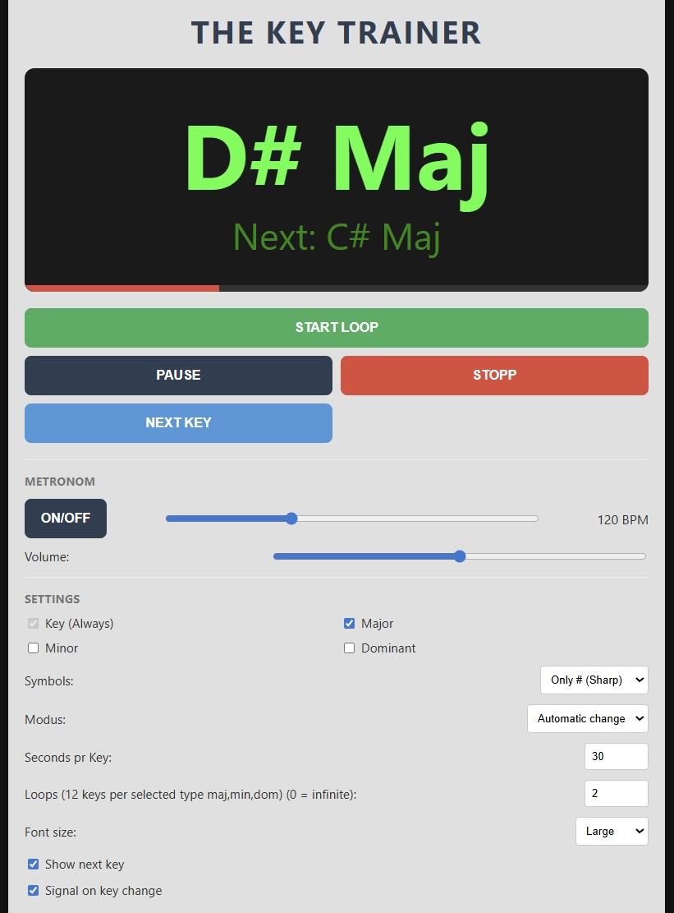

# THE KEY TRAINER

**THE KEY TRAINER** is a minimalist and effective tool for musicians who want to practice improvisation, chord changes, or scales in all 12 keys. The app generates randomized sequences of keys, forcing you out of your comfort zone and helping you master the entire fretboard or keyboard.

---

## ✨ Features

* **12-Key Loops:** Guarantees that you cycle through all 12 chromatic notes (C through B) in every single round.
* **Smart Variations:** Choose between simple note names, or include **Major**, **Minor**, and **Dominant** chord types.
* **Flexible Symbols:** Select your preferred accidental mode: **Sharp (#)**, **Flat (b)**, or a random mixture of both.
* **Integrated Metronome:** Built-in metronome with adjustable BPM and volume control.
* **Auto/Manual Mode:** Let the app change keys automatically after a set number of seconds, or control the progression manually.
* **Visual Focus:** Large, high-contrast display with an optional **"Next Key"** preview to help you stay one step ahead.

---

## 🔊 Important Note on Audio (Google Chrome)

If you experience issues with the metronome or the "key change" signal, it may be due to browser security policies regarding auto-playing audio:

> [!IMPORTANT]
> **Running from local disk:** If you open the `.html` file directly from your computer (e.g., `file://...`), Google Chrome may block the audio for security reasons.
> * **Solution:** Adjust your Chrome settings to "Allow sound" for local files, try a different browser (like Firefox), or host the file on a local server.
>
> **Running via GitHub Pages:** When accessed directly via **GitHub Pages** (the live URL), audio should function normally in all modern browsers as soon as you interact with the page (click any button).

---

## 🚀 How to Use

1.  **Configure Settings:** Check the chord variants you wish to practice (Maj/Min/Dom).
2.  **Select Mode:** Set the duration per key (e.g., 30 seconds) or choose **"Manual change"**.
3.  **Start:** Click **START LOOP**. The app shuffles all 12 keys and begins.
4.  **Infinite Practice:** Once all 12 keys are completed, a brand-new, unique sequence is automatically generated for the next round.

---

## 💡 Pro Training Tips

Even though the app displays "Maj", "Min", or "Dom", you are free to use these prompts as a foundation for any scale, mode, or arpeggio you want to practice.

* **Major Prompts:** Practice **Ionian**, **Lydian**, or Major 7th/9th arpeggios.
* **Minor Prompts:** Practice **Aeolian**, **Dorian**, **Phrygian**, or **Melodic Minor** scales.
* **Dominant Prompts:** Perfect your **Mixolydian** feel, or experiment with **Altered Dominant** and **Half-Whole Diminished** scales.
* **Technical Drills:** Use the timer to practice specific patterns, 3-notes-per-string scales, or inversions across the entire neck/keyboard.

---

## 🛠 Technology

* **HTML5 / CSS3**
* **JavaScript (Vanilla)**
* **Web Audio API** (for high-precision metronome timing and signals)

---

*Built for musicians who want to master every key.*